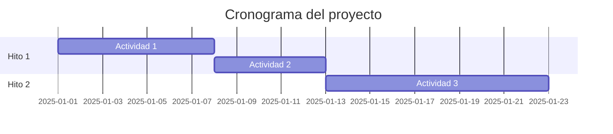

# Estimación, Cronograma y Presupuesto (Paso 6)

## Estimación de esfuerzos

### Análisis de Puntos de Función (FPA)

| Función | Tipo (EI/EO/EQ/ILF/EIF) | Complejidad | Puntos de función |
|---|---|---|---|
| | | | |

### Planning Poker

| Historia/Actividad | Estimación (puntos) | Consenso del equipo |
|---|---|---|
| | | |

## Cronograma

_Agrupa los elementos del EDT en hitos/entregables (usa Milestones del
repo). Cada actividad = un Issue asignado al Milestone correspondiente._

### PERT por actividad

| Actividad (issue) | Optimista (días) | Más probable (días) | Pesimista (días) | Duración esperada |
|---|---|---|---|---|
| #__ | | | | |

### Ruta crítica

_(identificar la secuencia de actividades sin holgura)_

### Diagrama de Gantt

## Presupuesto

| Concepto | Valor |
|---|---|
| Reserva de contingencia | |
| Reserva de gestión | |

### Curva S

_(tabla o gráfico acumulado de costo planeado vs. tiempo)_
